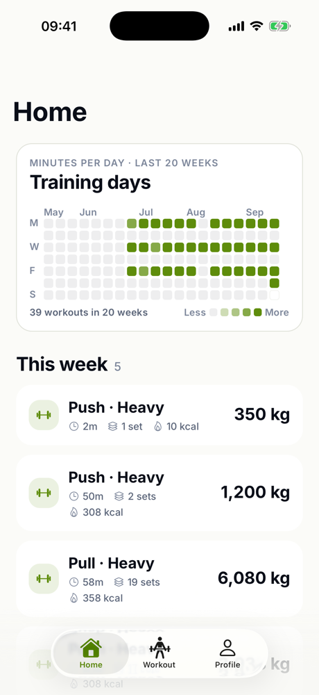
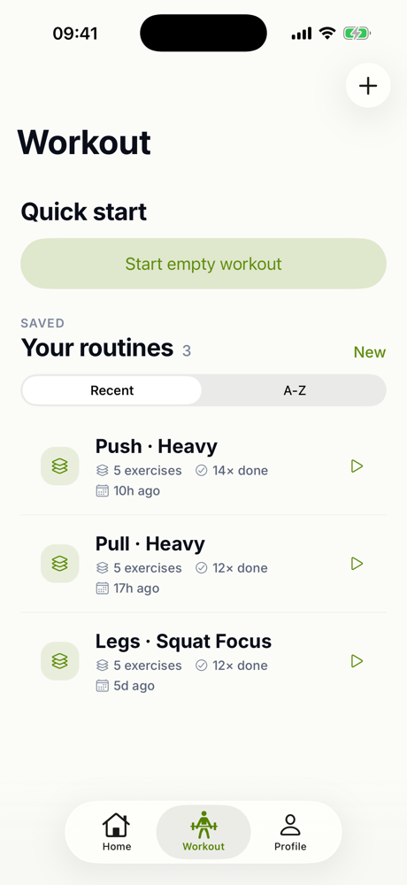
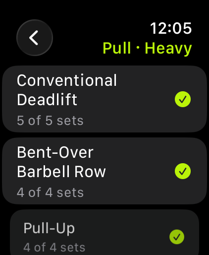
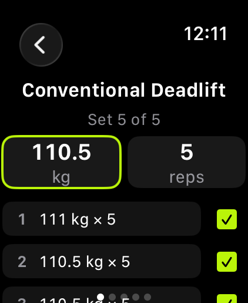

# Kinetiq

A gym workout tracker for iPhone, Android and Apple Watch. Build your routines, log every set,
and watch your training history grow. Everything stays on your device.

<p align="center">
  
  
</p>

<p align="center">
  
  
</p>

## Features

- **Routines**: create and edit your workouts, or start an empty one.
- **Live workout**: log weight and reps per set, with a rest timer and haptic feedback.
- **History**: a 20-week training heatmap, weekly goal, streaks, personal records and per-exercise progress.
- **Apple Watch**: run a full workout from your wrist; it syncs back to the phone when you finish.
- **Your data**: import and export routines as JSON, with a ready-made prompt to generate them with AI.
- **Personal**: metric or imperial, light or dark, five accent colours, English and Italian.

## Built with

- [Expo](https://expo.dev) SDK 57 and React Native, TypeScript (strict)
- [expo-router](https://docs.expo.dev/router/introduction/) for navigation
- [Expo UI](https://docs.expo.dev/versions/latest/sdk/ui/) for native SwiftUI and Jetpack Compose controls
- [TanStack Query](https://tanstack.com/query) over [expo-sqlite](https://docs.expo.dev/versions/latest/sdk/sqlite/) for local data
- [FlashList](https://shopify.github.io/flash-list/) and [Reanimated](https://docs.swmansion.com/react-native-reanimated/) for smooth lists and motion
- SwiftUI and WatchConnectivity for the Apple Watch app

## Run it

```sh
npm install
npm run ios       # or: npm run android
```
