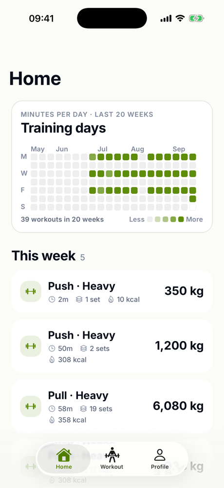
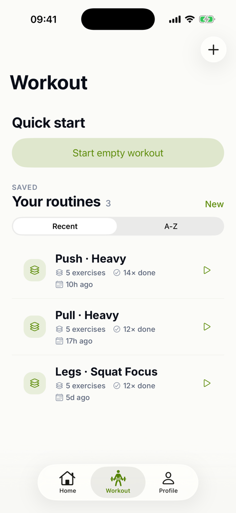
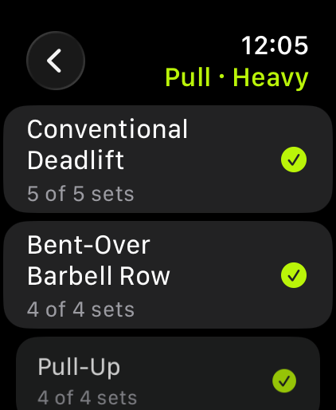
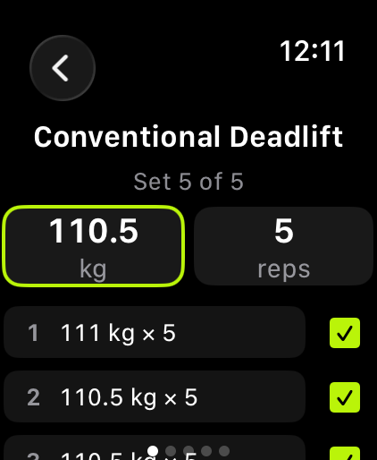

# Kinetiq

A gym workout tracker for iPhone, Android and Apple Watch. Build your routines, log every set,
and watch your training history grow. Everything stays on your device.

<p align="center">
  
  
</p>

<p align="center">
  
  
</p>

## Features

- **Routines**: create and edit your workouts, or start an empty one.
- **Exercise library**: the [free-exercise-db](https://github.com/yuhonas/free-exercise-db) catalog, over 900 exercises in English and Italian with start and end photos, numbered steps and similar exercises. It ships inside the app, so search, filters and photos work offline from the first launch.
- **Live workout**: log weight and reps per set, with a rest timer and haptic feedback.
- **History**: a 20-week training heatmap, weekly goal, streaks, personal records and per-exercise progress.
- **Apple Watch**: run a full workout from your wrist; it syncs back to the phone when you finish.
- **Your data**: import and export routines as JSON, with a ready-made prompt to generate them with AI.
- **Personal**: metric or imperial, light or dark, five accent colours, English and Italian.

## Built with

- [Expo](https://expo.dev) SDK 57 and React Native, TypeScript (strict)
- [expo-router](https://docs.expo.dev/router/introduction/) for navigation
- [Expo UI](https://docs.expo.dev/versions/latest/sdk/ui/) for native SwiftUI and Jetpack Compose controls
- [TanStack Query](https://tanstack.com/query) over [expo-sqlite](https://docs.expo.dev/versions/latest/sdk/sqlite/) for local data
- [FlashList](https://shopify.github.io/flash-list/) and [Reanimated](https://docs.swmansion.com/react-native-reanimated/) for smooth lists and motion
- SwiftUI and WatchConnectivity for the Apple Watch app

## Architecture

Kinetiq is built on the [agentic-kit](https://github.com/timothyrusso/agentic-kit) architecture
with [Effect](https://effect.website). Every file lives under `features/`, one folder per feature
in tiers (a feature imports only strictly lower tiers, through its `index.ts`), and `app/` holds
thin expo-router routes that re-export each feature's pages. Inside a feature, `domain/`, `data/`,
`useCases/` and `di/` are Effect (Tags, Layers, Schemas, tagged errors); facades run use cases on
the one app runtime through `useEffectQuery` and `useEffectMutation`; every view is a `.tsx` with
a `.logic.ts` ViewModel and a `.style.ts`.

- [`docs/ARCHITECTURE.md`](docs/ARCHITECTURE.md): the tier table and Kinetiq's deltas from the
  kit, its patterns and its documented exceptions.
- [`docs/EFFECT_NOTES.md`](docs/EFFECT_NOTES.md): where each part of the kit's Effect primer
  applies in this app.
- `npm run check` runs every gate (Biome, ESLint with the kit rules, `tsc`, dependency-cruiser,
  i18n parity and unused keys, knip, jest); `npm run test:coverage` adds the coverage floors;
  `npm run arch:report` prints the feature dependency graph.

## Run it

```sh
npm install
npm run ios       # or: npm run android
```

The exercise catalog is `assets/catalog/exercises.json`, edited by hand, with its photos under
`assets/catalog/images/`. After every edit of it or of `pendingPhotos.json`, `npm run
catalog:images` regenerates the image map the app bundles; bump `datasetVersion` so existing
installs pick the change up.

## Credits

Exercise data and photos come from [free-exercise-db](https://github.com/yuhonas/free-exercise-db),
released into the public domain under the [Unlicense](https://unlicense.org/).
